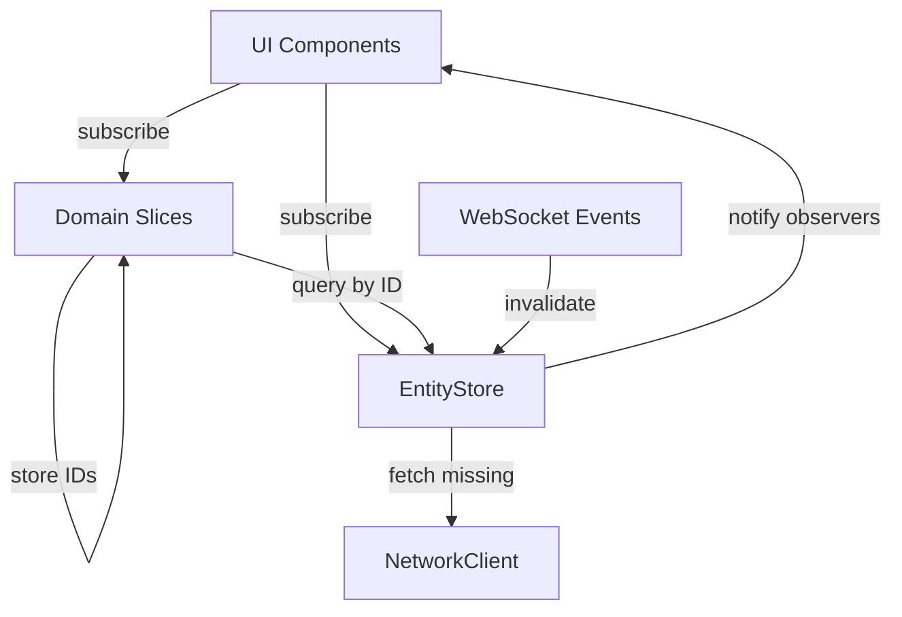

# Normalized Entity Store Implementation

## Typed JSON Integration with nlohmann/json

### Why nlohmann/json?

Replace `juce::var` with type-safe JSON parsing using **nlohmann/json** (header-only, modern C++):

- **Type safety**: Compile-time checking for JSON structure
- **Detailed validation**: Runtime errors report exactly which field failed and why
- **Macro-generated serialization**: Eliminate boilerplate with `NLOHMANN_DEFINE_TYPE_INTRUSIVE_WITH_VALIDATION`
- **C++26 compatible**: Works perfectly with modern C++ features (concepts, ranges, etc.)
- **Zero dependencies**: Header-only library, no external build requirements

### Setup

**CMakeLists.txt** addition:

```cmake
include(FetchContent)

FetchContent_Declare(
  nlohmann_json
  GIT_REPOSITORY https://github.com/nlohmann/json.git
  GIT_TAG v3.11.3
)
FetchContent_MakeAvailable(nlohmann_json)

target_link_libraries(${PROJECT_NAME} PRIVATE nlohmann_json::nlohmann_json)
```

### Custom Validation Macros

Create [`plugin/src/util/json/JsonValidation.h`](plugin/src/util/json/JsonValidation.h) for enhanced validation:

```cpp
#pragma once

#include <nlohmann/json.hpp>
#include <JuceHeader.h>
#include <stdexcept>
#include <string>

namespace Sidechain {
namespace Json {

// JSON validation exception with detailed error context
class ValidationError : public std::runtime_error {
public:
  ValidationError(const std::string& field, const std::string& reason, const std::string& context = "")
    : std::runtime_error("JSON validation failed for field '" + field + "': " + reason + 
                         (context.empty() ? "" : " (context: " + context + ")")) {}
};

// Required field validation
template<typename T>
T require(const nlohmann::json& j, const std::string& field) {
  if (!j.contains(field)) {
    throw ValidationError(field, "required field is missing", j.dump());
  }
  try {
    return j.at(field).get<T>();
  } catch (const nlohmann::json::exception& e) {
    throw ValidationError(field, "type mismatch - " + std::string(e.what()), j.dump());
  }
}

// Optional field with default
template<typename T>
T optional(const nlohmann::json& j, const std::string& field, const T& defaultValue) {
  if (!j.contains(field) || j.at(field).is_null()) {
    return defaultValue;
  }
  try {
    return j.at(field).get<T>();
  } catch (const nlohmann::json::exception& e) {
    throw ValidationError(field, "type mismatch - " + std::string(e.what()), j.dump());
  }
}

// Convert std::string to juce::String
inline juce::String toJuceString(const std::string& str) {
  return juce::String(str);
}

// Convert juce::String to std::string
inline std::string fromJuceString(const juce::String& str) {
  return str.toStdString();
}

// Custom macro for models with validation
#define SIDECHAIN_JSON_TYPE(Type, ...) \
  friend void to_json(nlohmann::json& j, const Type& obj); \
  friend void from_json(const nlohmann::json& j, Type& obj); \
  static Type fromJson(const nlohmann::json& j) { \
    try { \
      Type obj; \
      from_json(j, obj); \
      return obj; \
    } catch (const ValidationError& e) { \
      throw; \
    } catch (const std::exception& e) { \
      throw ValidationError("unknown", e.what(), j.dump()); \
    } \
  } \
  nlohmann::json toJson() const { \
    nlohmann::json j; \
    to_json(j, *this); \
    return j; \
  }

} // namespace Json
} // namespace Sidechain

// Helper macros for common patterns
#define JSON_REQUIRE(json, field, var) \
  var = Sidechain::Json::require<decltype(var)>(json, field)

#define JSON_OPTIONAL(json, field, var, defaultVal) \
  var = Sidechain::Json::optional<decltype(var)>(json, field, defaultVal)

#define JSON_REQUIRE_STRING(json, field, var) \
  var = Sidechain::Json::toJuceString(Sidechain::Json::require<std::string>(json, field))

#define JSON_OPTIONAL_STRING(json, field, var, defaultVal) \
  var = Sidechain::Json::toJuceString(Sidechain::Json::optional<std::string>(json, field, defaultVal))
```

### Model Example: User with Typed JSON

**New [`plugin/src/models/User.h`](plugin/src/models/User.h)**:

```cpp
#pragma once

#include "../util/json/JsonValidation.h"
#include <JuceHeader.h>
#include <nlohmann/json.hpp>

namespace Sidechain {

struct User {
  juce::String id;
  juce::String username;
  juce::String displayName;
  juce::String bio;
  juce::String avatarUrl;
  juce::String location;
  juce::String genre;
  juce::String daw;
  
  int followerCount = 0;
  int followingCount = 0;
  int postCount = 0;
  
  bool isPrivate = false;
  bool isVerified = false;
  bool isOnline = false;
  bool isFollowing = false; // Current user follows this user
  bool followsYou = false;  // This user follows current user
  
  juce::Time createdAt;
  juce::Time lastActive;
  
  // Typed JSON serialization
  SIDECHAIN_JSON_TYPE(User)
  
  // Validation
  bool isValid() const {
    return id.isNotEmpty() && username.isNotEmpty();
  }
  
  juce::String getId() const { return id; }
};

// Serialization implementation
inline void to_json(nlohmann::json& j, const User& user) {
  j = nlohmann::json{
    {"id", Json::fromJuceString(user.id)},
    {"username", Json::fromJuceString(user.username)},
    {"display_name", Json::fromJuceString(user.displayName)},
    {"bio", Json::fromJuceString(user.bio)},
    {"avatar_url", Json::fromJuceString(user.avatarUrl)},
    {"location", Json::fromJuceString(user.location)},
    {"genre", Json::fromJuceString(user.genre)},
    {"daw", Json::fromJuceString(user.daw)},
    {"follower_count", user.followerCount},
    {"following_count", user.followingCount},
    {"post_count", user.postCount},
    {"is_private", user.isPrivate},
    {"is_verified", user.isVerified},
    {"is_online", user.isOnline},
    {"is_following", user.isFollowing},
    {"follows_you", user.followsYou},
    {"created_at", user.createdAt.toISO8601(true).toStdString()},
    {"last_active", user.lastActive.toISO8601(true).toStdString()}
  };
}

inline void from_json(const nlohmann::json& j, User& user) {
  // Required fields with validation
  JSON_REQUIRE_STRING(j, "id", user.id);
  JSON_REQUIRE_STRING(j, "username", user.username);
  
  // Optional fields with defaults
  JSON_OPTIONAL_STRING(j, "display_name", user.displayName, "");
  JSON_OPTIONAL_STRING(j, "bio", user.bio, "");
  JSON_OPTIONAL_STRING(j, "avatar_url", user.avatarUrl, "");
  JSON_OPTIONAL_STRING(j, "location", user.location, "");
  JSON_OPTIONAL_STRING(j, "genre", user.genre, "");
  JSON_OPTIONAL_STRING(j, "daw", user.daw, "");
  
  JSON_OPTIONAL(j, "follower_count", user.followerCount, 0);
  JSON_OPTIONAL(j, "following_count", user.followingCount, 0);
  JSON_OPTIONAL(j, "post_count", user.postCount, 0);
  
  JSON_OPTIONAL(j, "is_private", user.isPrivate, false);
  JSON_OPTIONAL(j, "is_verified", user.isVerified, false);
  JSON_OPTIONAL(j, "is_online", user.isOnline, false);
  JSON_OPTIONAL(j, "is_following", user.isFollowing, false);
  JSON_OPTIONAL(j, "follows_you", user.followsYou, false);
  
  // Parse timestamps
  if (j.contains("created_at") && !j["created_at"].is_null()) {
    user.createdAt = juce::Time::fromISO8601(Json::toJuceString(j["created_at"].get<std::string>()));
  }
  if (j.contains("last_active") && !j["last_active"].is_null()) {
    user.lastActive = juce::Time::fromISO8601(Json::toJuceString(j["last_active"].get<std::string>()));
  }
}

} // namespace Sidechain
```

### Detailed Validation Example

**Error handling with context**:

```cpp
// In NetworkClient or EntityStore
try {
  auto json = nlohmann::json::parse(response.body);
  User user = User::fromJson(json);
  // Use user...
} catch (const Sidechain::Json::ValidationError& e) {
  // Detailed error: "JSON validation failed for field 'username': required field is missing (context: {...})"
  Util::logError("UserParser", e.what());
  
  // Show user-friendly error in UI
  showError("Invalid user data received from server");
}
```

### Migration Strategy: juce::var to nlohmann::json

**Phase 1: Add interop layer** (gradual migration support):

```cpp
// In JsonValidation.h
namespace Sidechain {
namespace Json {

// Convert juce::var to nlohmann::json
inline nlohmann::json fromJuceVar(const juce::var& v) {
  if (v.isObject()) {
    nlohmann::json j = nlohmann::json::object();
    auto* obj = v.getDynamicObject();
    if (obj) {
      for (auto& prop : obj->getProperties()) {
        j[prop.name.toStdString()] = fromJuceVar(prop.value);
      }
    }
    return j;
  } else if (v.isArray()) {
    nlohmann::json j = nlohmann::json::array();
    auto* arr = v.getArray();
    if (arr) {
      for (int i = 0; i < arr->size(); ++i) {
        j.push_back(fromJuceVar(arr->getUnchecked(i)));
      }
    }
    return j;
  } else if (v.isBool()) {
    return static_cast<bool>(v);
  } else if (v.isInt() || v.isInt64()) {
    return static_cast<int64_t>(v);
  } else if (v.isDouble()) {
    return static_cast<double>(v);
  } else if (v.isString()) {
    return v.toString().toStdString();
  }
  return nullptr; // null
}

// Convert nlohmann::json to juce::var (for legacy code)
inline juce::var toJuceVar(const nlohmann::json& j) {
  if (j.is_object()) {
    auto* obj = new juce::DynamicObject();
    for (auto it = j.begin(); it != j.end(); ++it) {
      obj->setProperty(it.key(), toJuceVar(it.value()));
    }
    return juce::var(obj);
  } else if (j.is_array()) {
    juce::Array<juce::var> arr;
    for (const auto& item : j) {
      arr.add(toJuceVar(item));
    }
    return juce::var(arr);
  } else if (j.is_boolean()) {
    return juce::var(j.get<bool>());
  } else if (j.is_number_integer()) {
    return juce::var(static_cast<int>(j.get<int64_t>()));
  } else if (j.is_number_float()) {
    return juce::var(j.get<double>());
  } else if (j.is_string()) {
    return juce::var(juce::String(j.get<std::string>()));
  }
  return juce::var(); // null/undefined
}

} // namespace Json
} // namespace Sidechain
```

**Phase 2: Migrate NetworkClient** - Replace all `juce::var` return types with `nlohmann::json`:

```cpp
// BEFORE:
rxcpp::observable<juce::var> NetworkClient::getUser(const juce::String& userId);

// AFTER:
rxcpp::observable<nlohmann::json> NetworkClient::getUser(const juce::String& userId);
```

**Phase 3: Update all existing models** - Convert FeedPost, Story, Playlist, etc. to use typed JSON

### Benefits of Typed JSON

1. **Catch errors at parse time**: Missing fields fail immediately with clear error messages
2. **Type safety**: No more `json.getProperty("field", defaultValue)` - compiler checks types
3. **Better IDE support**: Auto-complete for JSON field names
4. **Self-documenting**: Serialization code shows exact API contract
5. **Easier refactoring**: Rename fields and compiler finds all usages
6. **Performance**: nlohmann/json is faster than juce::var for parsing

### Example Error Messages

**Before (juce::var)**:

```
// Silent failure - returns default value ""
juce::String username = json.getProperty("username", "");
```

**After (nlohmann/json)**:

```
JSON validation failed for field 'username': required field is missing
Context: {"id": "123", "display_name": "Alice", ...}
```

## Architecture Overview

Create a new **EntityStore** layer that sits alongside your existing slice architecture. Slices will reference entities by ID (e.g., `postIds: Array<String>`), while EntityStore owns the actual entity data in hashtables. This provides:

- **Deduplication**: Same post/story/user in memory regardless of where it appears
- **Reactive updates**: Changes propagate to all UI components automatically
- **Optimistic updates**: UI updates immediately, rollback on error
- **Cache invalidation**: TTL-based, manual, and WebSocket-driven strategies



## Core Components

### 1. Entity Models (New/Enhanced)

Create missing model types and enhance existing ones for consistency:

**New models to create in [`plugin/src/models/`](plugin/src/models/)**:

- `User.h` - User profile entity (currently embedded in various places)
- `Conversation.h` - Chat conversation entity
- `Message.h` - Standalone message model (consolidate with StreamChatClient::Message)
- `Notification.h` - Standalone notification model (migrate from NotificationItem)
- `Draft.h` - Standalone draft model

**Existing models to keep**:

- [`FeedPost.h`](plugin/src/models/FeedPost.h) ✓
- [`Story.h`](plugin/src/models/Story.h) + `StoryHighlight` ✓
- [`Playlist.h`](plugin/src/models/Playlist.h) + `PlaylistEntry` ✓
- [`MidiChallenge.h`](plugin/src/models/MidiChallenge.h) + `MIDIChallengeEntry` ✓
- [`Sound.h`](plugin/src/models/Sound.h) ✓

All models must implement:

```cpp
// Required interface for entity normalization (with typed JSON)
struct EntityInterface {
  juce::String getId() const;
  static T fromJson(const nlohmann::json& json);  // Type-safe parsing
  nlohmann::json toJson() const;                   // Type-safe serialization
  bool isValid() const;
  
  // Auto-generated with SIDECHAIN_JSON_TYPE macro:
  // - friend void to_json(nlohmann::json& j, const T& obj);
  // - friend void from_json(const nlohmann::json& j, T& obj);
};
```

**Example - Migrating FeedPost to typed JSON**:

```cpp
// In FeedPost.h - add at end of struct definition
struct FeedPost {
  juce::String id;
  juce::String foreignId;
  // ... all other fields ...
  
  SIDECHAIN_JSON_TYPE(FeedPost)  // Generates fromJson/toJson methods
  
  juce::String getId() const { return id; }
  bool isValid() const { return id.isNotEmpty() && foreignId.isNotEmpty(); }
};

// In FeedPost.cpp - implement serialization
void to_json(nlohmann::json& j, const FeedPost& post) {
  j = nlohmann::json{
    {"id", Json::fromJuceString(post.id)},
    {"foreign_id", Json::fromJuceString(post.foreignId)},
    {"actor", Json::fromJuceString(post.actor)},
    {"verb", Json::fromJuceString(post.verb)},
    // ... all fields ...
  };
}

void from_json(const nlohmann::json& j, FeedPost& post) {
  JSON_REQUIRE_STRING(j, "id", post.id);
  JSON_REQUIRE_STRING(j, "foreign_id", post.foreignId);
  JSON_OPTIONAL_STRING(j, "actor", post.actor, "");
  JSON_OPTIONAL_STRING(j, "verb", post.verb, "");
  // ... all fields with validation ...
}
```

### 2. EntityStore Core (`plugin/src/stores/EntityStore.h`)

**Thread-safe normalized entity cache with reactive observables**:

```cpp
template<typename T>
class EntityCache {
  std::unordered_map<juce::String, T> entities_;
  std::unordered_map<juce::String, int64_t> timestamps_; // For TTL
  std::unordered_map<juce::String, std::vector<Observer>> observers_; // Per-entity observers
  mutable std::mutex mutex_;
  int64_t defaultTTL = 0; // 0 = no expiration
  
public:
  // Core operations
  std::optional<T> get(const juce::String& id) const;
  void set(const juce::String& id, const T& entity);
  void update(const juce::String& id, std::function<void(T&)> updater);
  void remove(const juce::String& id);
  bool has(const juce::String& id) const;
  
  // Batch operations
  std::vector<T> getMany(const juce::Array<juce::String>& ids) const;
  void setMany(const std::vector<T>& entities);
  
  // Reactive subscriptions (per-entity)
  Unsubscriber subscribe(const juce::String& id, std::function<void(const T&)> observer);
  
  // Cache invalidation
  void invalidate(const juce::String& id);
  void invalidateAll();
  void invalidatePattern(const juce::String& pattern); // e.g., "post:*"
  void expireStale(); // Remove TTL-expired entries
  
  // Optimistic updates with rollback
  void optimisticUpdate(const juce::String& id, std::function<void(T&)> updater, 
                        std::function<void(bool, const juce::String&)> onResult);
};

class EntityStore {
  // Entity caches (one per type)
  EntityCache<FeedPost> posts_;
  EntityCache<Story> stories_;
  EntityCache<User> users_;
  EntityCache<Notification> notifications_;
  EntityCache<Message> messages_;
  EntityCache<Conversation> conversations_;
  EntityCache<Playlist> playlists_;
  EntityCache<MIDIChallenge> challenges_;
  EntityCache<Draft> drafts_;
  EntityCache<Sound> sounds_;
  
  NetworkClient* networkClient_;
  
public:
  static EntityStore& getInstance();
  
  // Accessors for each entity type
  EntityCache<FeedPost>& posts() { return posts_; }
  EntityCache<Story>& stories() { return stories_; }
  // ... etc for all types
  
  // High-level fetch operations (with automatic caching)
  rxcpp::observable<FeedPost> fetchPost(const juce::String& id);
  rxcpp::observable<Story> fetchStory(const juce::String& id);
  rxcpp::observable<User> fetchUser(const juce::String& id);
  
  // Batch fetch (for feed loading)
  rxcpp::observable<std::vector<FeedPost>> fetchPosts(const juce::Array<juce::String>& ids);
  
  // WebSocket event handlers (cache invalidation with typed JSON)
  void onPostUpdated(const juce::String& postId, const nlohmann::json& data);
  void onStoryViewed(const juce::String& storyId);
  void onUserUpdated(const juce::String& userId, const nlohmann::json& data);
  void onMessageReceived(const juce::String& conversationId, const nlohmann::json& messageData);
  
  // TTL management
  void startExpirationTimer(); // Background thread to expire stale entries
  void setDefaultTTL(EntityType type, int64_t ttlMs);
};
```

### 3. Integration with Existing Slices

**Refactor slice states to store entity IDs instead of full objects**:

Example - `PostsState` in [`plugin/src/stores/app/AppState.h`](plugin/src/stores/app/AppState.h):

```cpp
// BEFORE (current):
struct PostsState {
  juce::Array<FeedPost> posts; // Full objects
  bool isLoading = false;
  // ...
};

// AFTER (normalized):
struct PostsState {
  juce::Array<juce::String> postIds; // Just IDs
  std::unordered_map<FeedType, juce::Array<juce::String>> feedPostIds; // IDs by feed type
  bool isLoading = false;
  // ...
  
  // Helper to resolve full posts (queries EntityStore)
  juce::Array<FeedPost> getPosts() const {
    auto& entityStore = EntityStore::getInstance();
    juce::Array<FeedPost> result;
    for (const auto& id : postIds) {
      if (auto post = entityStore.posts().get(id))
        result.add(*post);
    }
    return result;
  }
};
```

Apply same pattern to:

- `StoriesState` - Store `storyIds` instead of full `Story` objects
- `NotificationState` - Store `notificationIds`
- `ChatState` - Store `conversationIds` and `messageIdsByConversation`
- `PlaylistState` - Store `playlistIds`
- `ChallengeState` - Store `challengeIds`
- `DraftState` - Store `draftIds`

### 4. AppStore Integration

**Update AppStore methods in [`plugin/src/stores/AppStore.h`](plugin/src/stores/AppStore.h) to use EntityStore**:

Example for feed loading (`AppStore_Feed.cpp`):

```cpp
// BEFORE:
void AppStore::loadFeed(FeedType feedType, bool forceRefresh) {
  // ... fetch from network
  // Store full FeedPost objects in PostsSlice
  sliceManager.getPostsSlice()->dispatch([posts](PostsState& state) {
    state.posts = posts; // Full objects
  });
}

// AFTER (with typed JSON):
void AppStore::loadFeed(FeedType feedType, bool forceRefresh) {
  networkClient->getFeed(feedType)
    .subscribe([feedType](const nlohmann::json& data) {
      // Parse with type-safe JSON - automatically validates
      std::vector<FeedPost> posts;
      for (const auto& postJson : data["results"]) {
        try {
          posts.push_back(FeedPost::fromJson(postJson));
        } catch (const Json::ValidationError& e) {
          Util::logError("Feed", "Failed to parse post", e.what());
          continue; // Skip invalid posts
        }
      }
      
      // 1. Normalize posts into EntityStore
      EntityStore::getInstance().posts().setMany(posts);
      
      // 2. Store just IDs in slice
      juce::Array<juce::String> postIds;
      for (const auto& post : posts)
        postIds.add(post.id);
      
      sliceManager.getPostsSlice()->dispatch([feedType, postIds](PostsState& state) {
        state.feedPostIds[feedType] = postIds;
        state.isLoading = false;
      });
    });
}
```

### 5. Optimistic Updates with Rollback

**Implement copy-on-write optimistic updates for mutations** (like, save, repost):

```cpp
void AppStore::toggleLike(const juce::String& postId) {
  auto& entityStore = EntityStore::getInstance();
  
  // Optimistic update (immediate UI feedback)
  entityStore.posts().optimisticUpdate(
    postId,
    [](FeedPost& post) {
      post.isLiked = !post.isLiked;
      post.likeCount += post.isLiked ? 1 : -1;
    },
    [this, postId](bool success, const juce::String& error) {
      if (!success) {
        // Rollback already handled by EntityCache
        Util::logError("AppStore", "Failed to toggle like", error);
      } else {
        // Invalidate related caches
        invalidateFeedCaches();
      }
    }
  );
  
  // Send network request
  networkClient->likePost(postId)
    .subscribe(
      [](int _) { /* Success - optimistic update confirmed */ },
      [postId](std::exception_ptr e) { 
        // Trigger rollback callback
        // EntityCache will revert to saved state
      }
    );
}
```

### 6. Cache Invalidation Strategies

**TTL-based expiration**:

- Posts/feeds: 30 seconds (frequent updates)
- Stories: 5 minutes (24-hour lifespan, but view counts change)
- Users: 10 minutes (profiles change infrequently)
- Notifications: 1 minute (real-time expectations)
- Messages: No TTL (invalidate via WebSocket only)

**Manual invalidation** (expose via AppStore):

```cpp
void AppStore::invalidatePostCache(const juce::String& postId) {
  EntityStore::getInstance().posts().invalidate(postId);
}

void AppStore::invalidateFeedCaches() {
  // Clears all feed-related post IDs from slices
  sliceManager.getPostsSlice()->dispatch([](PostsState& state) {
    state.feedPostIds.clear();
  });
}
```

**WebSocket-driven invalidation** (integrate with existing handlers in `AppStore.h`):

```cpp
void AppStore::onWebSocketPostUpdated(const juce::String& postId, const nlohmann::json& data) {
  // Parse incoming WebSocket data with type safety
  try {
    auto updatedPost = FeedPost::fromJson(data);
    
    // Update EntityStore directly (no network fetch needed)
    EntityStore::getInstance().posts().set(postId, updatedPost);
    // EntityCache automatically notifies all subscribers
    
  } catch (const Json::ValidationError& e) {
    // Validation failed - fetch fresh from server as fallback
    Util::logError("WebSocket", "Invalid post data, fetching from server", e.what());
    EntityStore::getInstance().fetchPost(postId).subscribe([](const FeedPost& post) {});
  }
}
```

### 7. UI Component Updates

**Components subscribe to both slices (for lists) and EntityStore (for individual entities)**:

Example - Feed component:

```cpp
class FeedComponent : public AppStoreComponent<PostsState> {
  SubscriptionBag entitySubscriptions_;
  
  void onStateChanged(const PostsState& state) override {
    // Clear old subscriptions
    entitySubscriptions_.clear();
    
    // Get post IDs from slice
    auto postIds = state.feedPostIds[currentFeedType_];
    
    // Subscribe to each post entity for reactive updates
    auto& entityStore = EntityStore::getInstance();
    for (const auto& postId : postIds) {
      entitySubscriptions_.add(
        entityStore.posts().subscribe(postId, [this](const FeedPost& post) {
          updatePostRow(post); // Update UI when post changes
        })
      );
    }
  }
};
```

Example - Profile component viewing same post in multiple contexts:

```cpp
// Post appears in:
// 1. User's timeline feed
// 2. User's profile page
// 3. Search results
// All three UIs subscribe to same post entity by ID
// When user likes the post, ALL THREE update reactively
```

### 8. Background Expiration Timer

**Automatically expire stale cached entities**:

```cpp
// In EntityStore.cpp
void EntityStore::startExpirationTimer() {
  expirationTimer_ = std::make_unique<juce::Timer>();
  expirationTimer_->startTimer(60000); // Run every 60 seconds
  
  expirationTimer_->onTimerCallback([this]() {
    posts_.expireStale();
    stories_.expireStale();
    users_.expireStale();
    // ... etc
  });
}
```

## Implementation Order

### Phase 0: Typed JSON Foundation

1. Add nlohmann/json dependency to CMakeLists.txt
2. Create `JsonValidation.h` with custom macros and validation helpers
3. Create interop layer (juce::var ↔ nlohmann::json conversion)
4. Migrate one existing model (FeedPost) as proof-of-concept
5. Update NetworkClient to return `nlohmann::json` instead of `juce::var`

### Phase 1: Core Infrastructure

6. Create new model files with typed JSON (`User.h`, `Conversation.h`, `Message.h`, `Notification.h`, `Draft.h`)
7. Migrate remaining existing models (Story, Playlist, MidiChallenge, Sound) to typed JSON
8. Implement `EntityCache<T>` template class (works with typed models)
9. Implement `EntityStore` singleton with all entity type caches
10. Add TTL support and expiration timer

### Phase 2: Slice Integration

11. Refactor `PostsState` to store IDs instead of full posts
12. Update `AppStore_Feed.cpp` to normalize posts into EntityStore
13. Test post loading, liking, and display with new architecture

### Phase 3: Expand to Other Entities

14. Refactor `StoriesState`, `NotificationState`, `ChatState`, `PlaylistState`
15. Update corresponding AppStore methods to use EntityStore
16. Migrate existing cache logic (ImageCache, AudioCache remain separate for binary assets)

### Phase 4: Optimistic Updates

17. Implement copy-on-write optimistic updates in EntityCache
18. Add rollback support for failed mutations
19. Update all mutation methods (like, save, repost, follow, etc.)

### Phase 5: Cache Invalidation

20. Implement manual invalidation APIs
21. Wire up WebSocket event handlers to EntityStore (with typed JSON parsing)
22. Test real-time updates across multiple UI contexts

### Phase 6: UI Component Updates

23. Update feed components to subscribe to EntityStore
24. Update profile, search, and other components
25. Verify deduplication (same post in multiple feeds uses same memory)
26. Remove legacy juce::var interop layer once migration is complete

## File Structure

```
plugin/src/
├── util/
│   └── json/
│       ├── JsonValidation.h (new - typed JSON macros & validation)
│       └── JsonInterop.h (new - juce::var ↔ nlohmann::json bridge)
├── models/
│   ├── FeedPost.h (migrate to typed JSON)
│   ├── FeedPost.cpp (add to_json/from_json implementations)
│   ├── Story.h (migrate to typed JSON)
│   ├── Story.cpp (new - add serialization)
│   ├── User.h (new with typed JSON)
│   ├── User.cpp (new - serialization)
│   ├── Conversation.h (new with typed JSON)
│   ├── Conversation.cpp (new - serialization)
│   ├── Message.h (new with typed JSON)
│   ├── Message.cpp (new - serialization)
│   ├── Notification.h (new with typed JSON)
│   ├── Notification.cpp (new - serialization)
│   ├── Draft.h (new with typed JSON)
│   ├── Draft.cpp (new - serialization)
│   ├── Playlist.h (migrate to typed JSON)
│   ├── Playlist.cpp (new - serialization)
│   ├── MidiChallenge.h (migrate to typed JSON)
│   ├── MidiChallenge.cpp (new - serialization)
│   ├── Sound.h (migrate to typed JSON)
│   └── Sound.cpp (new - serialization)
├── stores/
│   ├── EntityStore.h (new)
│   ├── EntityStore.cpp (new)
│   ├── EntityCache.h (new - template implementation)
│   ├── AppStore.h (update - add EntityStore integration)
│   ├── app/
│   │   └── AppState.h (update - refactor all *State structs)
│   └── slices/
│       └── AppSlices.h (no changes needed)
├── network/
│   ├── NetworkClient.h (update - juce::var → nlohmann::json)
│   ├── NetworkClient.cpp (update - all return types)
│   └── api/
│       └── *.cpp (update all API clients to use nlohmann::json)
└── ui/
    └── (update components to subscribe to EntityStore)
```

## Key Benefits

### Entity Normalization Benefits

1. **Memory efficiency**: Same post/story/user shared across all UI contexts
2. **Consistency**: Updates in one place propagate everywhere automatically
3. **Performance**: No redundant network requests for already-cached entities
4. **Developer experience**: Subscribe to `entityStore.posts().subscribe(postId, ...)` - simple and reactive
5. **Testability**: EntityStore can be tested independently of slices and UI
6. **Type safety**: `std::unordered_map` with compile-time type checking

### Typed JSON Benefits

7. **Catch errors early**: Missing/invalid fields fail immediately with detailed context
8. **Self-documenting code**: Serialization shows exact API contract
9. **Refactoring safety**: Compiler catches all field accesses when renaming
10. **Better IDE support**: Auto-complete for field names, jump-to-definition
11. **Performance**: nlohmann/json is faster than juce::var for parsing large responses
12. **Macro-generated**: Eliminate boilerplate with `SIDECHAIN_JSON_TYPE` macro

### Combined Benefits

13. **End-to-end type safety**: From network response → entity cache → UI display
14. **Debugging**: Clear error messages pinpoint exactly what failed and why
15. **Maintainability**: Changes to models automatically caught at compile/parse time

## Migration Strategy

To avoid breaking existing functionality:

1. Keep existing AppStore methods working (but internally use EntityStore)
2. Gradually migrate UI components to subscribe to EntityStore
3. Run both old and new systems in parallel during transition
4. Once all components migrated, remove redundant slice state storage

## Complete Integration Flow Example

Here's how everything works together from API call to UI update:

```cpp
// 1. User action triggers API call
void onLikeButtonClicked(const juce::String& postId) {
  appStore.toggleLike(postId);
}

// 2. AppStore dispatches optimistic update to EntityStore
void AppStore::toggleLike(const juce::String& postId) {
  auto& entityStore = EntityStore::getInstance();
  
  // Optimistic update (immediate UI feedback)
  entityStore.posts().optimisticUpdate(postId, 
    [](FeedPost& post) {
      post.isLiked = !post.isLiked;
      post.likeCount += post.isLiked ? 1 : -1;
    },
    [](bool success, const juce::String& error) {
      // Rollback handled automatically on failure
    }
  );
  
  // Network request with typed JSON
  networkClient->likePost(postId)
    .subscribe(
      [](const nlohmann::json& response) {
        // Success - optimistic update confirmed
        // Parse response and update entity if server returns updated data
        try {
          auto updatedPost = FeedPost::fromJson(response["post"]);
          EntityStore::getInstance().posts().set(updatedPost.id, updatedPost);
        } catch (const Json::ValidationError& e) {
          // Validation failed - entity already updated optimistically
          Util::logWarning("Like", "Could not parse server response", e.what());
        }
      },
      [](std::exception_ptr e) {
        // Failure - rollback triggered automatically
        showError("Failed to like post");
      }
    );
}

// 3. EntityCache notifies all subscribers (reactive)
// - Feed component updates like button state
// - Profile component updates if post is shown there
// - Search results update if post appears there
// All three update automatically because they subscribe to the same post entity

// 4. Later, WebSocket pushes update from another user
void onWebSocketEvent(const std::string& eventJson) {
  try {
    auto event = nlohmann::json::parse(eventJson);
    
    if (event["type"] == "post.updated") {
      auto postData = event["data"];
      auto updatedPost = FeedPost::fromJson(postData);
      
      // Update EntityStore - all subscribers notified automatically
      EntityStore::getInstance().posts().set(updatedPost.id, updatedPost);
    }
  } catch (const Json::ValidationError& e) {
    Util::logError("WebSocket", "Invalid event data", e.what());
  }
}
```

## Testing

### Unit Tests

- **EntityCache operations**: get/set/update/invalidate/expireStale
- **Optimistic updates**: Verify rollback on failure
- **TTL expiration**: Verify expired entries are removed
- **Thread safety**: Concurrent access from multiple threads
- **Typed JSON parsing**: Validate all models parse correctly
- **JSON validation**: Verify detailed error messages for invalid data

### Integration Tests

- **EntityStore + NetworkClient**: Verify fetch operations cache correctly
- **EntityStore + WebSocket**: Verify real-time updates invalidate cache
- **AppStore + EntityStore**: Verify slice operations normalize to EntityStore
- **juce::var interop**: Verify legacy code still works during migration

### UI Tests

- **Reactive updates**: Same post in multiple feeds updates consistently
- **Optimistic UI**: Like button updates immediately, reverts on error
- **Memory deduplication**: Verify same entity ID has single memory address
- **Performance**: Load 1000+ posts, verify smooth scrolling and low memory usage

### Validation Tests

- **Missing required fields**: Verify ValidationError with field name
- **Type mismatches**: Verify ValidationError with expected vs actual type
- **Malformed JSON**: Verify graceful error handling
- **Partial success**: Verify array parsing continues after invalid item